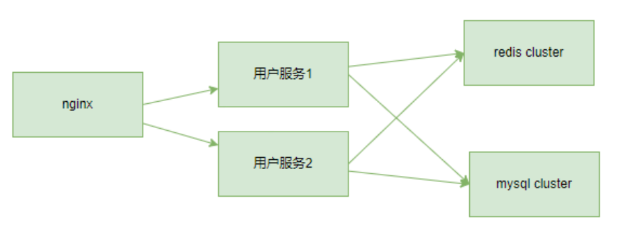

# 实战目的
通过 dockerfile 和 docker-compose 完成微服务的搭建，核心功能是实现用户管理微服务，整体拓扑如下：




# 实战步骤

> 1. 方案设计

a. 整体架构
系统整体架构


b. 库表设计


对应的 sql 语句
```sql
drop database if exists test;
CREATE DATABASE `test` DEFAULT CHARACTER SET utf8mb4 ;
use `test`;
CREATE TABLE `users` (
    `sno` int(11) PRIMARY KEY,
    `sname` varchar(50) DEFAULT NULL
) ENGINE=InnoDB DEFAULT CHARSET=utf8mb4;
INSERT INTO users (sno,sname) VALUES
                            (1,'pony'),
                            (2,'maxhou');
```

c. 接口设计，用户管理一般有用户的增加，用户编辑，用户查询，用户删除等功能，我们实现其中一个用户查询功能。用户查询功能的逻辑如下：


> 2. 创建相关目录

目录说明

- nginx: 负载均衡
- app: 
    - usr: 存放 java Spring 管理用户的微服务
- redis: 缓存
- mysql: 持久化


# 使用说明

在当前目录下: 
1. docker compose build
2. docker compose up -d

访问网页: 
http://{你的ip地址}:8888/userGet/1